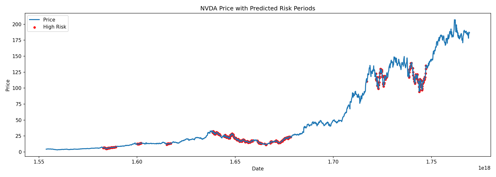
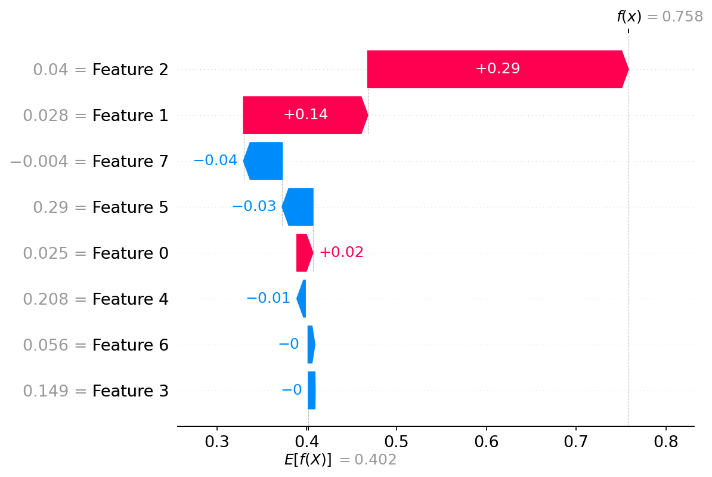
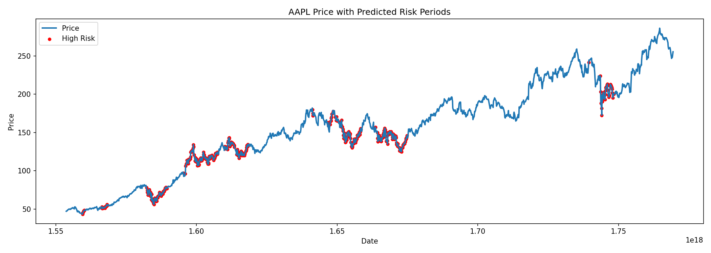
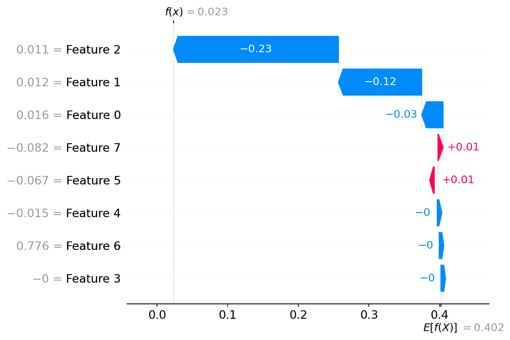
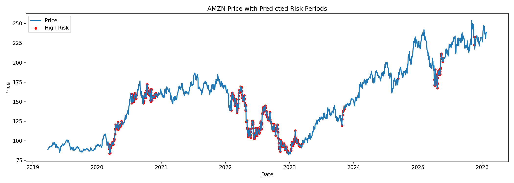
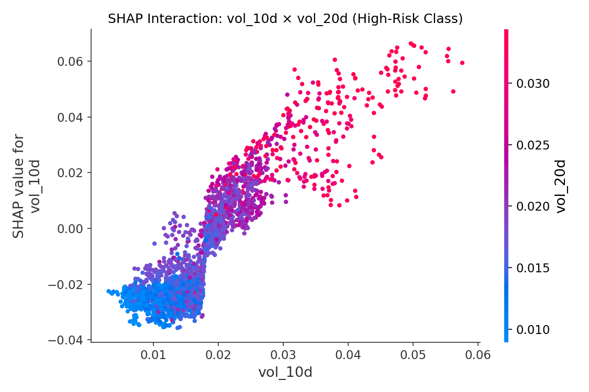

# Case Studies — Market Risk Regime Prediction

This document presents real-world case studies demonstrating how the model identifies, suppresses, and explains market risk regimes using interpretable machine learning.

---

## NVDA — Volatility Expansion (High Risk)

**Context**  
NVIDIA experienced increased market instability following rapid price appreciation, leading to volatility expansion across multiple time horizons.

**Model Prediction**  
The model flagged a **high-risk volatility regime**, with risk probability close to 1.

**Why the Model Flagged Risk (SHAP Explanation)**  
- `vol_30d` and `vol_20d` were the dominant contributors, indicating sustained volatility persistence  
- Drawdown amplified risk by signaling stress from recent local highs  
- Momentum features played a secondary role  

**Interpretation**  
> Risk was driven by volatility clustering across multiple horizons rather than a single-day price shock.

--- 

## AAPL — Volatility Compression (Low Risk)

**Context**  
Despite broader market uncertainty, Apple traded within a relatively stable range with compressed volatility.

**Model Prediction**  
The model strongly **suppressed risk**, producing a near-zero risk score.

**Why Risk Was Suppressed (SHAP Explanation)**  
- Low `vol_10d`, `vol_20d`, and `vol_30d` all pushed predictions downward  
- Minor momentum noise was insufficient to trigger a risk regime  

**Interpretation**  
> Volatility contraction acted as a stabilizing signal, leading the model to downgrade risk despite external noise.

---

## AMZN — Regime Transition (Early Warning)

**Context**  
Amazon transitioned from a low-volatility environment into a more unstable trading regime.

**Model Behavior**  
- Risk probability increased gradually before major price swings  
- The model provided early warning rather than reacting after instability occurred

**Key Insight (SHAP Interaction)**  
- Interaction between `vol_10d` and `vol_20d` strengthened as risk increased  
- Risk emerged due to volatility persistence across horizons rather than isolated spikes  

**Interpretation**  
> The model captures regime transitions by learning volatility persistence across multiple time windows.
